# ML Pipeline README

## 1. Project Context

The overall research goal is to combine probabilistic model checking with machine learning. In particular, the project aims to identify states, sets of states, or monitor-like conditions in Markov chains that can predict whether a future error, failure, or other target event will occur.

Rather than manually defining transition matrices or transition dictionaries in Python, the current implementation uses PRISM models loaded through StormPy. This makes it possible to work with established probabilistic-model benchmarks and to compare machine-learning results with exact model-checking results.

The intended workflow is:

```text
PRISM model
    → StormPy model construction
    → exact probability computation
    → trace generation
    → prefix dataset creation
    → machine learning
    → candidate state extraction
    → exact verification with Storm
```

## 2. What Was Done Before the ML Step

The first experiment used a small toy discrete-time Markov chain (DTMC) written in PRISM. It contained an initial state, normal states, a candidate or warning state, an error state, and a safe state.

StormPy successfully loaded this model, preserved its state labels and PRISM state valuations, and computed the exact probability of eventually reaching the error state:

```text
P(eventually error) = 0.4
```

This validated the basic StormPy integration before moving to a larger benchmark.

The next model was the official Bounded Retransmission Protocol (BRP) benchmark. BRP models the transmission of chunks over unreliable communication channels with a bounded number of retransmissions. The current configuration uses:

```text
N = 32
MAX = 1
```

- `N` is the number of chunks to transmit.
- `MAX` is the maximum number of retransmissions allowed.

For this configuration, Storm constructed a DTMC with:

- 804 reachable states
- 1,027 transitions

## 3. BRP Target Definitions

Different target labels were tested to investigate both final failures and intermediate warning conditions.

### Final error target

The first BRP target was the sender error state:

```prism
label "target" = s=5;
```

The successful terminal condition was:

```prism
label "success" = s=0 & srep=3;
```

This means that the sender returned to its idle state and reported successful completion.

For the final error target `s=5`, Storm computed:

```text
Exact target probability ≈ 0.0280295783
```

The results from 10,000 generated traces were:

- Target traces: 282
- Success traces: 9,718
- Truncated traces: 0
- Empirical target probability: 0.0282

The empirical result is consistent with the exact Storm probability. This dataset is imbalanced, but it is usable for an initial ML experiment because it contains 282 positive target examples.

### Retransmission warning target

An intermediate target was then tested:

```prism
label "target" = s=3;
```

Here, `s=3` is the sender retransmission state. It was selected because:

- `s=5` is the final sender error and is relatively rare.
- `s=3` is an intermediate warning or recovery state.
- It indicates that a message or acknowledgement timeout occurred and the protocol had to retransmit.
- It is more frequent and therefore useful for testing the ML pipeline quickly.

For the retransmission target `s=3`, Storm computed:

```text
Exact target probability ≈ 0.620195
```

Using 1,000 generated traces, the empirical results were:

- Target traces: 624
- Success traces: 376
- Truncated traces: 0
- Empirical target probability: 0.624
- Absolute estimation error: 0.003805

This agrees well with the exact probability and produces a substantially more balanced dataset.

## 4. Trace Generation

Traces are generated directly from the DTMC constructed by Storm, not from a manually written Python transition dictionary.

For each trace, the generator:

1. Starts at the model's initial state.
2. Reads the outgoing transitions and their probabilities from the Storm model.
3. Randomly samples the next state according to those probabilities.
4. Continues until the target label, the success label, or the maximum number of steps is reached.

The output categories mean:

- **Target trace:** a trace that reaches the selected target condition.
- **Success trace:** a trace that reaches the successful terminal condition without first reaching the target.
- **Truncated trace:** a trace that reaches neither target nor success before `max_steps`.
- **Empirical target probability:** the number of target traces divided by the total number of generated traces.
- **Exact target probability:** the probability computed by exact Storm model checking.
- **Absolute estimation error:** the absolute difference between the empirical and exact target probabilities.

All experiments so far produced zero truncated traces, indicating that `max_steps=500` was sufficient for the current BRP configuration.

## 5. Prefix-Based ML Idea

The intended ML task is not to classify a complete trace after its outcome is already known. Instead, the task is:

> Given only an observed prefix of a trace, predict whether the complete trace will eventually reach the target.

- A **full trace** is the complete generated execution.
- A **prefix** is only the first part of that trace and is used as ML input.
- The **label** is the final outcome of the full trace.

For example:

```text
Full trace:
0 → 10 → 24 → 37 → target

Prefix with prefix_fraction = 0.5:
0 → 10

Label:
target = 1
```

Varying the observed amount can help investigate how early the target becomes predictable. The current fractional-prefix implementation is an exploratory baseline: because it calculates the prefix length from the completed trace length, it can leak outcome-related length information. A stronger follow-up experiment should use an outcome-independent observation rule, such as a fixed number of initial transitions or a fixed protocol checkpoint.

The visited-state dataset script supports two mutually exclusive observation modes. A fractional prefix uses a specified fraction of each completed trace, preserving the earlier exploratory behavior but making the observation length depend on the completed trace length. A fixed transition window observes the same number of transitions from the start of every retained trace: `--prefix-length k` selects the initial state plus the next `k` states, for `k + 1` observed state IDs. Traces with `k` or fewer transitions are excluded so that the observed window cannot contain or coincide with the terminal state.

Fixed transition windows are preferred for the primary prediction experiment because their observation length does not depend on the completed trace length. For example:

```bash
python -m src.ml.create_brp_visited_state_dataset \
    --input data/raw/brp_stress_tuned_traces_10000.csv \
    --output data/processed/brp_stress_tuned_visited_state_dataset_k10.csv \
    --prefix-length 10
```

Run the Logistic Regression, Decision Tree, and Random Forest baselines on the fixed `k5`, `k10`, `k20`, and `k50` datasets with:

```bash
python -m scripts.run_brp_fixed_window_baselines
```

The runner writes per-window JSON files (`k5.json`, `k10.json`, `k20.json`, and `k50.json`) and `combined_metrics.csv` under:

```text
results/metrics/brp_fixed_windows/
```

### Common-cohort fixed-window datasets

The operational-window analysis above retains traces separately at each
window: a k-window dataset contains traces with more than k transitions. This
describes prediction among traces that are still active at each observation
point, but its population changes with k.

The common-cohort analysis instead selects
`number_of_transitions > 50` once and uses those same ordered trace IDs and
targets for k=5, 10, 20, and 50. It therefore supports a controlled comparison
of information gained from longer prefixes without changing trace population
or deterministic train/test membership.

Generate all four ignored datasets and the tracked validation manifest with:

```bash
python -m scripts.generate_brp_common_cohort_datasets
```

Common-cohort datasets retain `trace_id` as row metadata. The
`visited_states_only` feature selector uses only `visited_state_*` columns, so
`trace_id`, `target`, `prefix_length`, and `last_state` never enter the ML
features.

Run the common-cohort baseline comparison with:

```bash
python -m scripts.run_brp_common_cohort_baselines
```

All four windows use the same 9,177 traces, constant class balance, and one
shared deterministic stratified train/test trace-ID split. Changes across k
are therefore attributable mainly to additional observed prefix information,
not changing cohort composition or split membership. The features still
encode only visited-state presence; they do not preserve full sequence order,
transition order, or repeated state visits.

The follow-up k=20 training-sample-size, ranking-stability, and exact candidate
quality experiment is documented in
[BRP sample-size stability](../../docs/brp_sample_size_stability.md).

## 6. First Dataset: Summary Prefix Features

The first ML dataset used simple summary features calculated from each prefix:

- `first_state`
- `last_state`
- `prefix_length`
- `unique_states`
- `total_state_visits`
- `min_state_id`
- `max_state_id`
- `target`

This provided a quick baseline, but it is not fully aligned with the main research goal because it does not tell the model exactly which states occurred in the prefix.

For the final error target `s=5`, the 10,000-trace dataset had the following distribution:

- `target = 0`: 9,718
- `target = 1`: 282

Three baseline classifiers were trained:

- Logistic Regression
- Decision Tree
- Random Forest

Random Forest performed best on the summary-feature dataset, with approximately:

- Accuracy: 0.9990
- Precision: 1.0000
- Recall: 0.9643
- F1-score: 0.9818

Although these results were strong, features such as `last_state` and `prefix_length` may be highly correlated with the final outcome. In particular, the relative-prefix construction can expose information about the completed trace length. The results must therefore be treated as preliminary rather than as final evidence of generalizable prediction.

## 7. Improved Dataset: Visited-State Prefix Features

A more meaningful representation was then created in which each feature indicates whether a particular Storm state occurred in the prefix. Example columns include:

- `visited_state_0`
- `visited_state_1`
- `visited_state_2`
- `...`
- `prefix_length`
- `last_state`
- `target`

This representation is more closely aligned with the research goal because the ML model can learn which states or sets of states are predictive of the target.

For example, if a prefix visits:

```text
0 → 12 → 25
```

then:

```text
visited_state_0  = 1
visited_state_12 = 1
visited_state_25 = 1
```

Most other `visited_state_*` features are `0`. This representation also enables later extraction of candidate predictive states.

For the final error target `s=5`, the visited-state dataset using 50% prefixes had:

- `target = 0`: 9,718
- `target = 1`: 282

The stratified training and test distributions were:

| Split | `target = 0` | `target = 1` |
|---|---:|---:|
| Training | 7,774 | 226 |
| Testing | 1,944 | 56 |

### Logistic Regression

- Accuracy: 0.9865
- Precision: 0.6933
- Recall: 0.9286
- F1-score: 0.7939
- Confusion matrix:

```text
[[1921, 23],
 [   4, 52]]
```

Logistic Regression detected 52 of the 56 target traces but produced 23 false positives.

### Decision Tree

- Accuracy: 0.9915
- Precision: 0.7910
- Recall: 0.9464
- F1-score: 0.8618
- Confusion matrix:

```text
[[1930, 14],
 [   3, 53]]
```

The Decision Tree detected 53 of the 56 target traces and produced 14 false positives.

### Random Forest

- Accuracy: 0.9985
- Precision: 1.0000
- Recall: 0.9464
- F1-score: 0.9725
- Confusion matrix:

```text
[[1944,  0],
 [   3, 53]]
```

Random Forest detected 53 of the 56 target traces and produced no false positives. It was the best model in this run.

Logistic Regression produced a convergence warning on the visited-state dataset, likely because of the large number of binary features and the class imbalance. Potential improvements include increasing the iteration limit, scaling suitable features, or testing a different solver.

As with the summary dataset, the visited-state results remain preliminary because a relative 50% prefix can indirectly reveal the completed trace length. The visited-state representation improves feature meaning, but it does not by itself remove this leakage.

## 8. Why These ML Models Were Chosen

### Logistic Regression

Logistic Regression is a simple linear classifier that estimates the probability that a trace prefix belongs to the target class.

It was selected because it is:

- Fast
- A simple baseline
- Relatively interpretable through its coefficients
- Useful for determining whether a linear relationship exists

### Decision Tree

A Decision Tree is a rule-based model that repeatedly divides the data using conditions on input features.

It was selected because it is:

- Interpretable
- Able to produce rule-like explanations
- Suitable for investigating predictive states or conditions

### Random Forest

A Random Forest combines the predictions of many decision trees.

It was selected because it:

- Is generally more robust than a single tree
- Handles nonlinear feature interactions
- Can provide feature-importance scores
- Can help identify candidate predictive states

These models were chosen before considering more complex techniques because the first objective was to validate the complete pipeline from model construction to ML evaluation.

## 9. Pros and Cons of the Current Approach

### Pros

- The pipeline works from PRISM model construction through StormPy, trace generation, dataset creation, and ML training.
- It no longer depends on manually written Python transition dictionaries.
- Exact Storm probabilities can be compared with empirical simulation probabilities.
- The visited-state representation supports the search for predictive states.
- Random Forest gives strong initial performance for the final error target.
- The retransmission target `s=3` provides a more balanced intermediate target for further experiments.

### Cons and limitations

- The final error target `s=5` remains imbalanced.
- The visited-state representation ignores state order, so prefixes `A → B` and `B → A` can look identical.
- A relative 50% prefix can reveal completed-trace length and make prediction artificially easy.
- Shorter fractions such as 20% and 10% should be explored, but fixed-transition or fixed-checkpoint prefixes are needed to eliminate the underlying look-ahead issue.
- The models predict outcomes but do not yet automatically verify candidate states with Storm.
- Sampled data can contain repeated traces or repeated prefixes, which must be considered when constructing train/test splits.
- Feature-importance extraction and exact probability-raising verification remain future work.
- Storm state IDs are model-specific; important states must be mapped back to their PRISM valuations for interpretation.

## 10. Current Conclusions

- The StormPy integration works.
- The BRP benchmark can be loaded, model checked, and sampled.
- The final error target `s=5` produces a usable but imbalanced dataset.
- A visited-state prefix representation is more aligned with the project goal than simple summary statistics.
- Random Forest has performed best so far for the final error target.
- The retransmission target `s=3` is promising because it is more frequent and represents an intermediate warning condition.
- Current ML scores are exploratory and must be re-evaluated with outcome-independent observation prefixes before making strong predictive claims.
- The next stage is to compare observation points, extract candidate states, and verify those candidates exactly with Storm.

## 11. Next Steps

1. Run ML training for the retransmission target `s=3`.
2. Compare the final error target `s=5` with the retransmission target `s=3`.
3. Compare prefix fractions of 50%, 20%, and 10% as exploratory experiments.
4. Add fixed-transition or fixed-protocol-checkpoint observations to remove completed-trace-length leakage.
5. Extract feature importances from Random Forest.
6. Identify candidate predictive states.
7. Map important Storm state IDs back to PRISM valuations.
8. Use Storm to verify probability raising:

   ```text
   P(target | candidate visited) > P(target)
   ```

9. Try other BRP properties where useful.
10. Later, consider order-aware features such as transition counts or sequence models.

## Progress Update — 2026-07-09

### 1. Motivation After the Last Meeting

After the last meeting, the focus was to move beyond the initial BRP final-error experiment and investigate whether changing BRP model parameters and target definitions could produce better datasets for ML-based predictor discovery. The main issue was class imbalance.

The earlier experiment used final sender error as the target:

```prism
label "target" = s=5;
```

Here, `s=5` is the sender error state. With the previous BRP configuration, this event was rare:

- Exact Storm probability: approximately `0.0280295783`
- Generated traces: `10,000`
- Target traces: `282`
- Success traces: `9,718`
- Truncated traces: `0`
- Positive rate: `2.82%`

This dataset was usable, but it was strongly imbalanced toward success. The next step was therefore to create additional experimental settings that provide a more informative class distribution while keeping the interpretation of each target explicit.

### 2. Retransmission Target Experiment

I tested an intermediate target:

```prism
label "target" = s=3;
```

Here, `s=3` is the sender retransmission state. This target was chosen because:

- `s=5` represents final sender error and is relatively rare.
- `s=3` represents retransmission.
- Retransmission means the protocol has experienced message or acknowledgement loss and must retry.
- It is an intermediate warning or recovery state that may occur before final failure.
- Its higher frequency can provide a more balanced learning target.

This experiment used:

- Model: `models/prism/brp/brp_retransmit_target.pm`
- Property: `models/properties/brp/brp_target.pctl`

The property was:

```prism
P=? [ F "target" ]
```

The result for `1,000` traces was:

- Exact Storm target probability: `0.620195`
- Target traces: `624`
- Success traces: `376`
- Truncated traces: `0`
- Empirical target probability: `0.624000`
- Absolute estimation error: `0.003805`

This result showed that the retransmission target is much more balanced than the final-error target.

However, this is no longer a final-failure prediction task. It asks whether the sender will enter retransmission, rather than whether the protocol will end in sender error. It is therefore useful as a warning-event prediction experiment, but it must be clearly distinguished from final-error prediction.

### 3. BRP Stress / High-Loss Error Target Experiment

I then investigated a stress-test/high-loss BRP variant in which the target remains final sender error:

```prism
label "target" = s=5;
```

The goal was to preserve the final-error prediction task while changing channel reliability so that final error occurs more often. In BRP:

- `channelK` is the data/frame channel.
- `channelL` is the acknowledgement channel.
- Increasing loss probabilities in these channels makes communication less reliable and final sender error more likely.

The first high-loss setting was:

```prism
[aF] (k=0) -> 0.70 : (k'=1) + 0.30 : (k'=2);
[aA] (l=0) -> 0.80 : (l'=1) + 0.20 : (l'=2);
```

This produced too many final-error traces:

- States: `1,221`
- Transitions: `1,603`
- Exact Storm target probability: `0.9420998011`
- Generated traces: `10,000`
- Target traces: `9,435`
- Success traces: `565`
- Truncated traces: `0`
- Empirical target probability: `0.9435000000`
- Positive rate: `94.35%`

This confirmed that changing channel reliability had the intended effect, but the first setting overshot: the resulting dataset was strongly imbalanced toward the target class.

I therefore tuned the stress setting to a more moderate version:

```prism
[aF] (k=0) -> 0.85 : (k'=1) + 0.15 : (k'=2);
[aA] (l=0) -> 0.90 : (l'=1) + 0.10 : (l'=2);
```

This corresponds to:

- Data/frame loss probability: `15%`
- Acknowledgement loss probability: `10%`

The tuned experimental model was saved as:

```text
models/prism/brp/brp_stress_error_target.pm
```

For `10,000` generated traces, the tuned stress model produced:

- Number of traces: `10,000`
- Random seed: `42`
- Maximum steps per trace: `500`
- Target label: `target`
- Target traces: `3,429`
- Success traces: `6,571`
- Truncated traces: `0`
- Average transitions per trace: `180.0112`
- Exact Storm target probability: `0.341645`
- Empirical target probability: `0.342900`
- Absolute estimation error: `0.001255`

The class balance was:

- Positive target traces: `3,429` (`34.29%`)
- Negative success traces: `6,571` (`65.71%`)
- Truncated traces: `0` (`0.00%`)

This is a useful balance for baseline ML training because the target is neither too rare nor too frequent. This model remains an experimental high-loss BRP variant and should not be presented as the original benchmark configuration.

### 4. Generic Trace Generator Output Improvement

I noticed that the generic trace generator:

```text
src/storm/generate_traces.py
```

did not print the same helpful class-balance summary as the BRP-specific generator:

```text
src/storm/generate_brp_traces.py
```

The generic script is needed for experiments such as `brp_stress_error_target.pm` because it supports custom model, property, and label arguments. I improved its reporting so that it prints:

- Positive target traces
- Negative terminal traces, including negative success traces for BRP
- Truncated traces
- Class percentages
- Useful imbalance notices

For the tuned stress dataset, the improved output was:

```text
Class balance
-------------
Positive target traces: 3429 (34.29%)
Negative success traces: 6571 (65.71%)
Truncated traces: 0 (0.00%)

Notice: the dataset has a reasonably balanced target/success split for baseline ML training.
```

This makes the suitability of generated traces easier to evaluate before creating an ML dataset.

### 5. Dataset Inspection and Leakage Check

Before training on the tuned stress dataset, I inspected the raw traces because of a possible data-leakage issue. If a trace were very short, a 50% prefix might accidentally include its terminal target or success state. In that case, the classifier would see the answer rather than predict a future outcome.

The raw trace dataset was:

```text
data/raw/brp_stress_tuned_traces_10000.csv
```

It contained `10,000` rows and `7` columns:

- `trace_id`
- `state_ids`
- `valuations`
- `terminal_label`
- `reached_target`
- `reached_monitor`
- `number_of_transitions`

Terminal-label counts were:

- `success`: `6,571`
- `target`: `3,429`

Reached-target counts were:

- `0`: `6,571`
- `1`: `3,429`

The transition-count summary was:

| Statistic | Transitions |
| --- | ---: |
| Count | 10,000 |
| Mean | 180.01120 |
| Standard deviation | 63.82639 |
| Minimum | 8 |
| 25% | 156 |
| Median | 212 |
| 75% | 220 |
| Maximum | 254 |

The shortest traces had `8` transitions and were target traces. One example shortest trace was:

```text
0|1|3|5|8|11|16|21|28
```

I then checked 50% prefixes for direct terminal-state leakage:

- Total traces: `10,000`
- Very short traces with no more than 3 states: `0`
- Prefixes containing the terminal state: `0`
- Leakage rate: `0.0000%`

For the 50% prefix setting, there was no direct terminal-state leakage: the model did not directly see the final target or success state.

This does not prove that the task is completely free from easy patterns, nor does it make the task impossible. Some early states or patterns along short target paths may still be genuinely predictive. The check establishes only that the terminal state itself was not included in the observed prefixes.

### 6. Visited-State Dataset Creation

I created a visited-state prefix dataset from the tuned stress raw traces using the following conceptual configuration:

```text
input: data/raw/brp_stress_tuned_traces_10000.csv
output: data/processed/brp_stress_tuned_visited_state_dataset_50.csv
prefix_fraction: 0.5
```

The resulting dataset had:

- Rows: `10,000`
- Visited-state features: `552`
- `target = 0`: `6,571`
- `target = 1`: `3,429`
- Positive rate: `0.3429`

Example feature columns are:

```text
visited_state_0
visited_state_1
visited_state_2
...
```

The exact highest suffix depends on which Storm state IDs appear in the prefixes; there are approximately `552` such feature columns in this dataset.

Each `visited_state_*` feature records whether the corresponding state appeared anywhere in the observed prefix. The columns are sorted by state ID for consistency, but this does not mean that a trace visits states in numerical order. The raw `state_ids` column preserves actual execution order.

For example, these prefixes have the same visited-state representation:

```text
0 -> 10 -> 25 -> 14
0 -> 14 -> 25 -> 10
```

They contain the same set of states even though their execution orders differ. This loss of order is a limitation, but the representation remains useful for the current research goal of identifying candidate predictive states or state sets.

### 7. Ablation Study: Checking Whether `last_state` Caused High Accuracy

Initial training performance was high, so I tested whether it resulted from leakage through the `last_state` feature. The original feature set included:

- `visited_state_*` features
- `prefix_length`
- `last_state`

The concern was that the last observed prefix state might make prediction too easy if it were already close to target or success. I therefore compared three feature configurations:

1. `all_features`: `visited_state_*`, `prefix_length`, and `last_state`
2. `no_last_state`: `visited_state_*` and `prefix_length`
3. `visited_states_only`: only `visited_state_*`

#### All features

| Model | Accuracy | Precision | Recall | F1-score | Confusion matrix |
| --- | ---: | ---: | ---: | ---: | --- |
| Logistic Regression | 0.9630 | 0.9888 | 0.9023 | 0.9436 | `[[1307, 7], [67, 619]]` |
| Decision Tree | 0.9650 | 0.9828 | 0.9140 | 0.9471 | `[[1303, 11], [59, 627]]` |
| Random Forest | 0.9610 | 0.9967 | 0.8892 | 0.9399 | `[[1312, 2], [76, 610]]` |

#### Without `last_state`

| Model | Accuracy | Precision | Recall | F1-score | Confusion matrix |
| --- | ---: | ---: | ---: | ---: | --- |
| Logistic Regression | 0.9630 | 0.9873 | 0.9038 | 0.9437 | `[[1306, 8], [66, 620]]` |
| Decision Tree | 0.9635 | 0.9797 | 0.9125 | 0.9449 | `[[1301, 13], [60, 626]]` |
| Random Forest | 0.9630 | 0.9984 | 0.8936 | 0.9431 | `[[1313, 1], [73, 613]]` |

#### Visited-state features only

| Model | Accuracy | Precision | Recall | F1-score | Confusion matrix |
| --- | ---: | ---: | ---: | ---: | --- |
| Logistic Regression | 0.9630 | 0.9873 | 0.9038 | 0.9437 | `[[1306, 8], [66, 620]]` |
| Decision Tree | 0.9450 | 0.9486 | 0.8878 | 0.9172 | `[[1281, 33], [77, 609]]` |
| Random Forest | 0.9580 | 0.9934 | 0.8834 | 0.9352 | `[[1310, 4], [80, 606]]` |

Removing `last_state` did not significantly reduce performance. Even with only visited-state features, Logistic Regression and Random Forest remained strong. This suggests that the predictive signal is not mainly caused by `last_state` leakage; the set of states visited in the prefix already contains useful information about whether the target will be reached.

This is evidence of predictive structure, not a formal causality result.

### 8. Current Interpretation

The tuned stress-target experiment is useful because:

- The target remains final sender error, `s=5`.
- The target probability is approximately `34%`, which is suitable for baseline ML.
- The empirical simulation probability closely matches the exact Storm probability.
- The 50% prefixes contain no direct terminal-state leakage.
- The ablation study suggests that the models are not relying only on `last_state`.
- The visited-state representation aligns with the project goal of identifying candidate predictive states.

Important limitations remain:

- A 50% prefix may still be highly informative even without containing the terminal state.
- The visited-state representation ignores execution order.
- Models may exploit state-set patterns that occur close to failure.
- The current results demonstrate prediction, not formal causality.
- Candidate states still need to be extracted and verified with Storm.
- The modified channel probabilities make this an experimental/high-loss BRP variant, not the original benchmark setting.

No claim is being made yet that the ML models have identified formal causes.

### 9. What I Plan to Do Next

1. Generate 20% and 10% prefix datasets for the tuned stress model.
2. Compare performance across 50%, 20%, and 10% prefixes.
3. Add a training-script option to exclude `last_state` and `prefix_length`, replacing the temporary ad hoc ablation code.
4. Extract feature importances or coefficients from the trained models.
5. Identify important `visited_state_*` features as candidate predictive states.
6. Map important Storm state IDs back to PRISM valuations.
7. Use Storm to test whether the candidates raise the probability of reaching the target.
8. Compare three experimental settings:
   - Rare final-error target
   - Retransmission warning target
   - Tuned stress final-error target
9. Later, consider transition-count features or order-aware representations because visited-state features ignore order.

---

## BRP Fixed-Window Candidate-State Experiment — 16 July 2026

### 1. Goal

This experiment connects the full analysis pipeline:

```text
PRISM/Storm model checking
    → trace generation
    → fixed-window ML prediction
    → candidate-state ranking
    → mapping Storm IDs to PRISM valuations
    → exact state-based Storm verification
```

Machine learning is used to prioritize preliminary candidate predictor states from sampled trace prefixes. Storm then performs the exact state-based check on those candidates. The ML score is therefore a discovery heuristic, while the Storm result is the model-derived probability of eventually reaching the target from a specified current state.

### 2. Model configuration

The experiment uses the BRP benchmark with the final sender-error target:

```prism
label "target" = s=5;
```

The actual tuned model configuration is:

| Item | Value |
| --- | --- |
| Number of chunks, \(N\) | 32 |
| Maximum retransmissions, \(\mathit{MAX}\) | 2 |
| Frame/data channel delivery probability | 0.85 |
| Frame/data channel loss probability | 0.15 |
| Acknowledgement channel delivery probability | 0.90 |
| Acknowledgement channel loss probability | 0.10 |
| Reachable Storm states | 1,221 |
| Storm transitions | 1,603 |
| Exact initial target probability | 0.341644584515 |

This is a tuned, higher-loss experimental BRP configuration rather than the original benchmark parameterization.

### 3. Raw trace dataset

The raw dataset contains 10,000 traces generated from the tuned model:

| Outcome | Traces | Fraction |
| --- | ---: | ---: |
| Target | 3,429 | 0.3429 |
| Success | 6,571 | 0.6571 |
| Total | 10,000 | 1.0000 |

The empirical target probability is `0.3429`, compared with the exact Storm probability `0.341644584515`.

Trace lengths below are numbers of transitions:

| Outcome | Minimum | Median | Mean | Maximum |
| --- | ---: | ---: | ---: | ---: |
| Target | 8 | 106 | 108.5733 | 250 |
| Success | 194 | 216 | 217.2902 | 254 |

Target traces can terminate much earlier than successful protocol executions. This difference is important because an observation rule based on completed trace length can indirectly expose information about the eventual outcome.

### 4. Why fixed observation windows were introduced

The earlier fractional-prefix experiment observed a fraction of each completed trace. Completed trace length is not available at prediction time, and the raw data shows substantially different target and success length distributions. Consequently, a fractional prefix length can reveal outcome-related length information even when the terminal state itself is absent.

Fixed windows instead observe exactly \(k\) transitions from the start of each trace. A trace that terminates at or before \(k\) is excluded, ensuring that the observed window neither contains nor coincides with its terminal target or success state.

| Window | Retained traces | Excluded target | Excluded success | Retained positive rate | Visited-state features |
| ---: | ---: | ---: | ---: | ---: | ---: |
| 5 | 10,000 | 0 | 0 | 0.3429 | 12 |
| 10 | 9,956 | 44 | 0 | 0.3400 | 39 |
| 20 | 9,723 | 277 | 0 | 0.3242 | 94 |
| 50 | 9,177 | 823 | 0 | 0.2840 | 251 |

Each retained row contains \(k+1\) observed state IDs because the initial state is included alongside the \(k\) transitions.

### 5. Fixed-window baseline results

All models use only ordered `visited_state_*` indicator columns. The split is stratified with `test_size=0.2` and `random_seed=42`.

| Window | Model | Accuracy | Precision | Recall | F1 | ROC-AUC | FN | TP | Features |
| ---: | --- | ---: | ---: | ---: | ---: | ---: | ---: | ---: | ---: |
| 5 | Logistic Regression | 0.6305 | 0.4120 | 0.1808 | 0.2513 | 0.5245 | 562 | 124 | 12 |
| 5 | Decision Tree | 0.6305 | 0.4120 | 0.1808 | 0.2513 | 0.5245 | 562 | 124 | 12 |
| 5 | Random Forest | 0.6305 | 0.4120 | 0.1808 | 0.2513 | 0.5245 | 562 | 124 | 12 |
| 10 | Logistic Regression | 0.5979 | 0.3869 | 0.3131 | 0.3461 | 0.5276 | 465 | 212 | 39 |
| 10 | Decision Tree | 0.5979 | 0.3869 | 0.3131 | 0.3461 | 0.5277 | 465 | 212 | 39 |
| 10 | Random Forest | 0.5979 | 0.3869 | 0.3131 | 0.3461 | 0.5277 | 465 | 212 | 39 |
| 20 | Logistic Regression | 0.6314 | 0.3930 | 0.2504 | 0.3059 | 0.5397 | 473 | 158 | 94 |
| 20 | Decision Tree | 0.6540 | 0.4019 | 0.1363 | 0.2036 | 0.5147 | 545 | 86 | 94 |
| 20 | Random Forest | 0.6211 | 0.3848 | 0.2805 | 0.3245 | 0.5283 | 454 | 177 | 94 |
| 50 | Logistic Regression | 0.5969 | 0.3166 | 0.3628 | 0.3381 | 0.5383 | 332 | 189 | 251 |
| 50 | Decision Tree | 0.6716 | 0.3277 | 0.1497 | 0.2055 | 0.5173 | 443 | 78 | 251 |
| 50 | Random Forest | 0.6247 | 0.3213 | 0.2898 | 0.3047 | 0.5246 | 370 | 151 | 251 |

ROC-AUC is approximately 0.52–0.54, so early prediction from visited-state indicators alone is weak. Accuracy is also influenced by class imbalance and should not be read as strong discrimination. The earlier high fractional-prefix scores should therefore be interpreted cautiously because their observation length depended on completed trace length. This is a useful methodological result rather than a failed experiment: the fixed-window design exposes how much weaker the genuinely early signal is.

### 6. Selected k=20 candidate-state analysis

The k=20 window was selected for preliminary candidate extraction because Logistic Regression achieved the strongest ROC-AUC (`0.5397`), while k=50 was close (`0.5383`). The k=5 and k=10 datasets contained only 3 and 11 distinct visited-state patterns, respectively. In contrast, k=50 excluded 823 target traces, substantially more than the 277 excluded at k=20.

Candidate ranking combines three signals:

1. **Positive Logistic Regression coefficient:** direction and strength toward target/error prediction.
2. **Random Forest feature importance:** predictive usefulness, without indicating direction.
3. **Positive empirical probability difference:** \(P(\text{target}\mid\text{state visited in the first 20 transitions}) - P(\text{target}\mid\text{state not visited in the first 20 transitions})\).

The three non-negative signals are min-max normalized and averaged. The result is multiplied by the support-reliability weight

```text
visited_count / (visited_count + minimum_support)
```

with `minimum_support=50`. The combined score is a ranking heuristic, not an error probability. Empirical statistics use the complete retained k=20 dataset, including rows used during model training and testing, so candidate discovery is exploratory rather than an unbiased performance evaluation.

### 7. Top candidate states

| ML rank | Storm state ID | Combined score | LR coefficient | RF importance | Visits | P(target \| visited) | P(target \| not visited) | Empirical difference |
| ---: | ---: | ---: | ---: | ---: | ---: | ---: | ---: | ---: |
| 1 | 89 | 0.6041 | 0.1629 | 0.068688 | 176 | 0.5398 | 0.3202 | 0.2196 |
| 2 | 82 | 0.5675 | 0.1629 | 0.059003 | 176 | 0.5398 | 0.3202 | 0.2196 |
| 3 | 101 | 0.5539 | 0.4980 | 0.053027 | 83 | 0.5181 | 0.3225 | 0.1956 |
| 4 | 69 | 0.3401 | 0.3113 | 0.011687 | 250 | 0.4160 | 0.3218 | 0.0942 |
| 5 | 83 | 0.3226 | 0.3534 | 0.007011 | 217 | 0.4055 | 0.3223 | 0.0832 |
| 6 | 102 | 0.2659 | -0.0571 | 0.022411 | 111 | 0.5045 | 0.3221 | 0.1824 |
| 7 | 99 | 0.2509 | 0.3246 | 0.017147 | 85 | 0.3882 | 0.3236 | 0.0646 |
| 8 | 95 | 0.2509 | -0.0571 | 0.017931 | 111 | 0.5045 | 0.3221 | 0.1824 |
| 9 | 93 | 0.2110 | 0.2334 | 0.008462 | 485 | 0.3464 | 0.3230 | 0.0234 |
| 10 | 44 | 0.2012 | 0.3306 | 0.008346 | 166 | 0.3012 | 0.3246 | -0.0234 |

The ranking can retain a candidate with one negative component because the other components may still provide positive evidence. For example, state 102 has a negative Logistic Regression coefficient but positive Random Forest and empirical signals.

### 8. Storm ID to PRISM valuation mapping

Storm internal state IDs are indices in the constructed sparse model; they are not values of any PRISM variable. Trace generation, candidate mapping, and exact verification all use the same `load_prism_model` construction path, including state valuations and labels.

| Rank | State ID | s | i | nrtr | r | rrep | k | l |
| ---: | ---: | ---: | ---: | ---: | ---: | ---: | ---: | ---: |
| 1 | 89 | 3 | 3 | 1 | 4 | 2 | 0 | 0 |
| 2 | 82 | 2 | 3 | 1 | 4 | 2 | 2 | 0 |
| 3 | 101 | 2 | 3 | 1 | 4 | 2 | 0 | 2 |
| 4 | 69 | 3 | 2 | 1 | 4 | 2 | 0 | 0 |
| 5 | 83 | 2 | 2 | 2 | 2 | 2 | 0 | 0 |
| 6 | 102 | 2 | 3 | 2 | 2 | 2 | 0 | 0 |
| 7 | 99 | 2 | 3 | 1 | 4 | 2 | 2 | 0 |
| 8 | 95 | 2 | 3 | 2 | 4 | 2 | 1 | 0 |
| 9 | 93 | 3 | 3 | 0 | 4 | 2 | 0 | 0 |
| 10 | 44 | 2 | 2 | 1 | 4 | 1 | 2 | 0 |

In the PRISM model, `s` is the sender control state, `i` is the current chunk index, and `nrtr` is the retransmission count. The variables `r` and `rrep` are the receiver control and report states. Variables `k` and `l` are the frame/data and acknowledgement channel states. Their numeric meanings are documented by comments in the model.

No special labels are directly attached to these intermediate candidate states, which is expected: the model labels identify the final `target` and `success` conditions rather than every intermediate protocol state.

### 9. Exact Storm state-based verification

The exact baseline is:

```text
P(target from initial state 0) = 0.341644584515
```

The verification output is sorted by exact probability difference, while retaining the original ML rank:

| ML rank | State ID | Valuation summary | Empirical difference | Exact P(target) from state | Exact difference | Raises probability |
| ---: | ---: | --- | ---: | ---: | ---: | :---: |
| 4 | 69 | `s=3, i=2, nrtr=1, r=4, rrep=2, k=0, l=0` | 0.0942 | 0.483027 | 0.141382 | Yes |
| 1 | 89 | `s=3, i=3, nrtr=1, r=4, rrep=2, k=0, l=0` | 0.2196 | 0.476229 | 0.134585 | Yes |
| 2 | 82 | `s=2, i=3, nrtr=1, r=4, rrep=2, k=2, l=0` | 0.2196 | 0.476229 | 0.134585 | Yes |
| 3 | 101 | `s=2, i=3, nrtr=1, r=4, rrep=2, k=0, l=2` | 0.1956 | 0.476229 | 0.134585 | Yes |
| 5 | 83 | `s=2, i=2, nrtr=2, r=2, rrep=2, k=0, l=0` | 0.0832 | 0.391796 | 0.050152 | Yes |
| 16 | 56 | `s=2, i=2, nrtr=1, r=3, rrep=2, k=0, l=0` | 0.0165 | 0.340099 | -0.001546 | No |
| 20 | 22 | `s=1, i=2, nrtr=0, r=4, rrep=1, k=0, l=0` | -0.0161 | 0.332988 | -0.008656 | No |
| 15 | 100 | `s=2, i=3, nrtr=1, r=4, rrep=2, k=0, l=1` | -0.0372 | 0.315332 | -0.026312 | No |

Seventeen of the top 20 candidates raise the exact future target probability above the initial-state baseline. States 69, 44, 51, 61, and 63 all have an exact target probability of approximately `0.483027`. States 89, 82, 101, and 99 all have an exact probability of approximately `0.476229`.

The ML and exact Storm rankings are not identical. ML learns from sampled prefixes containing correlated state indicators, whereas Storm evaluates future behavior from one current state in the mathematical model. Several distinct sparse-model states can also have probability-equivalent future behavior. Storm computes the model probability from the current state exactly, subject to the numerical precision of the implementation.

### 10. Interpretation and limitation

The current exact state-based verification computes:

```text
P(eventually target | currently in candidate state)
```

It does **not** yet compute:

```text
P(eventually target | candidate was visited earlier)
```

The stricter historical or path-conditioned quantity requires a monitored/product model with a persistent `seen_candidate` condition, or an equivalent conditional path construction. The present results identify preliminary candidate predictor states and probability-raising candidates; they do not establish that these states are formal causes.

### 11. Reproduction commands

Generate the k=20 fixed-window dataset:

```bash
python -m src.ml.create_brp_visited_state_dataset \
    --input data/raw/brp_stress_tuned_traces_10000.csv \
    --output data/processed/brp_stress_tuned_visited_state_dataset_k20.csv \
    --prefix-length 20
```

Run all fixed-window baselines:

```bash
python -m scripts.run_brp_fixed_window_baselines
```

Train and save the k=20 models and schema:

```bash
python -m src.ml.train_brp_baselines \
    --dataset data/processed/brp_stress_tuned_visited_state_dataset_k20.csv \
    --feature-set visited_states_only \
    --test-size 0.2 \
    --random-seed 42 \
    --metrics-output results/metrics/brp_fixed_windows/k20.json \
    --model-output-dir results/models/brp_fixed_windows/k20 \
    --observation-window 20
```

Extract ranked candidates:

```bash
python -m scripts.extract_brp_candidate_states \
    --dataset data/processed/brp_stress_tuned_visited_state_dataset_k20.csv \
    --model-dir results/models/brp_fixed_windows/k20 \
    --output results/candidate_states/brp_k20_candidate_states.csv \
    --top-k 20 \
    --minimum-support 50
```

Map Storm IDs to PRISM valuations:

```bash
python -m scripts.map_brp_candidate_states \
    --model models/prism/brp/brp_stress_error_target.pm \
    --property models/properties/brp/brp_target.pctl \
    --candidates results/candidate_states/brp_k20_candidate_states.csv \
    --output results/candidate_states/brp_k20_candidate_state_valuations.csv \
    --top-k 20
```

Verify both exact initial-to-candidate reachability and exact
candidate-to-target reachability with Storm:

```bash
python -m scripts.verify_brp_candidate_states \
    --model models/prism/brp/brp_stress_error_target.pm \
    --property models/properties/brp/brp_target.pctl \
    --candidates results/candidate_states/brp_k20_candidate_states.csv \
    --output results/systematic/brp_stress_error/reachability/candidate_exact_reachability.csv \
    --top-k 20
```

The output also reports `risk_weighted_coverage`, defined as exact candidate
reachability multiplied by exact target probability from the candidate. This
is a descriptive heuristic, not a formal causality measure.

The empirical and exact reachability columns describe different events.
`empirical_support_fraction` is the fraction of the 9,723 retained k20 traces
in which the candidate appears within the initial state plus the first 20
transitions. This empirical population is conditioned on the trace having
more than 20 transitions. In contrast, `exact_candidate_reachability` is the
unbounded, unconditional Storm probability `P_initial(F candidate)` over all
model paths.

Accordingly, `support_reachability_absolute_gap` and
`support_reachability_relative_gap` are descriptive gaps, not Monte Carlo
estimation errors. They combine sampling variation, the finite empirical
observation horizon, and population conditioning. A matched comparison would
require either full-trace empirical visitation over all raw traces versus
unbounded exact reachability, or an exact bounded and survival-conditioned
reachability calculation matching the k20 dataset.

### 12. Artifact links

The compact CSV/JSON experiment records and feature schema below should be
deliberately committed for reproducibility after regeneration from a clean
source commit. Raw and processed datasets, serialized joblib models, logs,
predictions, caches, and other bulky generated files should remain untracked.

- [Combined fixed-window metrics](../../results/metrics/brp_fixed_windows/combined_metrics.csv)
- [k=5 metrics](../../results/metrics/brp_fixed_windows/k5.json)
- [k=10 metrics](../../results/metrics/brp_fixed_windows/k10.json)
- [k=20 metrics](../../results/metrics/brp_fixed_windows/k20.json)
- [k=50 metrics](../../results/metrics/brp_fixed_windows/k50.json)
- [k=20 model metadata](../../results/models/brp_fixed_windows/k20/metadata.json)
- [k=20 feature schema](../../results/models/brp_fixed_windows/k20/feature_columns.json)
- [Ranked k=20 candidates](../../results/candidate_states/brp_k20_candidate_states.csv)
- [Candidate-ranking metadata](../../results/candidate_states/brp_k20_candidate_states.metadata.json)
- [Candidate PRISM valuations](../../results/candidate_states/brp_k20_candidate_state_valuations.csv)
- [Candidate-mapping metadata](../../results/candidate_states/brp_k20_candidate_state_valuations.metadata.json)
- [Exact reachability verification](../../results/systematic/brp_stress_error/reachability/candidate_exact_reachability.csv)
- [Exact-reachability metadata](../../results/systematic/brp_stress_error/reachability/candidate_exact_reachability.metadata.json)
- [Tuned BRP PRISM model](../../models/prism/brp/brp_stress_error_target.pm)
- [Target property](../../models/properties/brp/brp_target.pctl)

### 13. Current status and next steps

Completed:

- [x] Tuned BRP target configuration
- [x] Exact and empirical target probability comparison
- [x] Fixed-window datasets
- [x] Reproducible baseline metrics
- [x] Saved k=20 models and feature schema
- [x] Candidate-state extraction
- [x] Storm-ID-to-valuation mapping
- [x] Exact state-based Storm verification

Pending:

- [ ] Independently generated seed-123 validation dataset
- [ ] Candidate-ranking stability across seeds
- [ ] Richer fixed-window features
- [ ] Strict path-conditioned probability raising
- [ ] Final experiment cleanup and documentation

# Meeting Update — BRP Systematic Evaluation and Exact Candidate Reachability

Date: 2026-07-27

## 1. Objectives since the previous meeting

The work since the previous meeting focused on making the BRP evaluation more
systematic and connecting ML-selected states to exact Storm probabilities. It
addressed five questions:

1. How does prediction quality change with the observation-window length?
2. Was the earlier prefix comparison affected by using different trace
   populations?
3. How likely is each ML-selected candidate state to be reached from the
   initial state?
4. Once a candidate is reached, how strongly does it raise the exact future
   target probability?
5. Can the experimental results be presented through reproducible tables and
   plots?

No new neural-network model was added. The priority was systematic evaluation,
cohort control, and exact Storm verification of the current interpretable
baselines.

## 2. Model and target configuration

- Benchmark: Bounded Retransmission Protocol (BRP)
- Model: `models/prism/brp/brp_stress_error_target.pm`
- Property: `models/properties/brp/brp_target.pctl`
- Target: final sender error, `s=5`
- Storm model size: 1,221 states and 1,603 transitions
- Exact initial target probability: `0.3416445845150787`
- Original trace dataset: 10,000 traces
- Original class counts: 3,429 target and 6,571 success

The binary machine-learning task is:

> Given an observed execution prefix, predict whether the complete execution
> will eventually reach the final sender-error state.

This is binary outcome classification. It is not next-state prediction, and it
is not yet formal causal inference.

## 3. Why the common cohort was needed

### Operational-window experiment

The operational experiment independently retains traces satisfying
`number_of_transitions > k` at every observation window. Its populations are:

| Window | Retained traces |
| ---: | ---: |
| k=5 | 10,000 |
| k=10 | 9,956 |
| k=20 | 9,723 |
| k=50 | 9,177 |

The population and class balance therefore change with `k`. Short
target-ending traces are progressively excluded as the required survival
window becomes longer.

### Common-cohort experiment

The controlled experiment first selects traces satisfying
`number_of_transitions > 50`, then creates four feature views of those same
9,177 traces using the first 5, 10, 20, or 50 transitions.

- Retained target traces: 2,606
- Retained success traces: 6,571
- Target rate: `0.2839707966`, approximately 0.284
- Training rows: 7,341
- Test rows: 1,836
- Trace IDs and deterministic train/test membership are identical at every
  window.
- No terminal-state leakage was detected.

This design makes changes across `k` attributable mainly to additional
observed prefix information rather than changing trace composition.

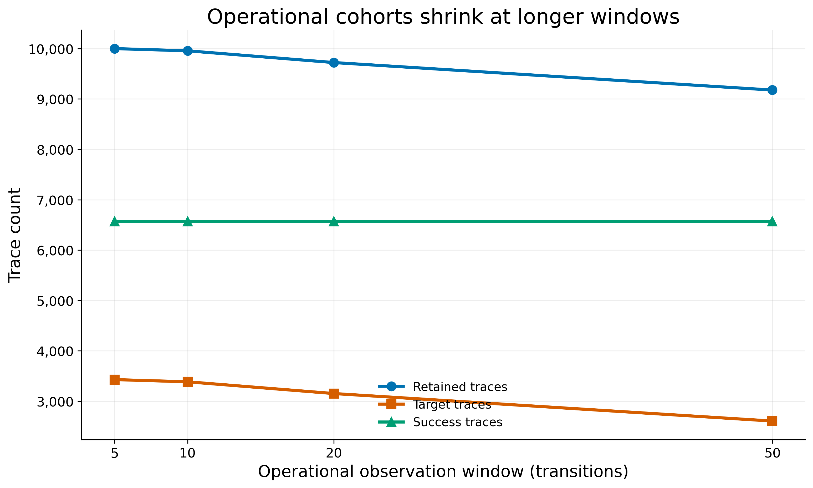

Retained traces decrease because progressively longer operational windows
exclude executions that have already terminated. In this dataset, the
excluded short executions are target traces, while the 6,571 success traces
remain. The target rate consequently falls from 0.3429 at k=5 to approximately
0.2840 at k=50. This population shift motivated the common-cohort experiment.

## 4. Machine-learning representation

The current representation is binary visited-state presence:

```text
visited_state_X = 1 if Storm state X occurs in the observed prefix, otherwise 0
```

It captures which states were observed. It discards:

- state order;
- transition order;
- repeated visits;
- time spent in a state.

The results therefore measure the predictive value of unordered visited-state
presence, not the predictive value of a complete execution sequence.

## 5. Models

### Logistic Regression

Logistic Regression predicts the positive-class probability from a weighted
linear combination of features transformed by the logistic function. A
positive coefficient for `visited_state_X` means that observing state X raises
the model's predicted log-odds of eventual target, conditional on the other
features.

A coefficient is not itself a probability. `exp(coefficient)` is an odds
multiplier, and correlations among visited-state features can affect the
coefficient values.

### Decision Tree

A Decision Tree applies a sequence of binary rules, such as “Was state X
visited?” It can represent nonlinear combinations of states, but a single tree
can be unstable or overfit its training sample.

### Random Forest

A Random Forest combines many decision trees trained on different samples and
feature subsets. It can represent nonlinear interactions, but impurity-based
feature importance has no direction and does not itself prove probability
raising.

## 6. Evaluation metrics

### Accuracy

Accuracy is the fraction of all test traces classified correctly. It can be
misleading when target and success classes are imbalanced because a model can
obtain high accuracy by favoring the majority class.

### Precision

```text
precision = TP / (TP + FP)
```

Among traces predicted as eventual targets, precision asks how many actually
reached the target.

### Recall

```text
recall = TP / (TP + FN)
```

Among all traces that actually reached the target, recall asks how many the
classifier detected.

### F1 score

```text
F1 = 2 × precision × recall / (precision + recall)
```

F1 is the harmonic mean of precision and recall. A higher F1 means that the
classifier balances detecting target traces and avoiding false target
predictions more effectively. F1 does not account for true negatives directly
and depends on the selected classification threshold.

### ROC-AUC

ROC-AUC measures how well predicted scores rank a randomly chosen target trace
above a randomly chosen success trace across all classification thresholds.
A value of 0.5 is approximately random ranking, while 1.0 is perfect ranking.
Values near 0.5 indicate weak discrimination. ROC-AUC is useful here because it
measures ranking ability independently of one hard decision threshold.

The confusion-matrix terms are:

- TN: success correctly predicted as success;
- FP: success incorrectly predicted as target;
- FN: target incorrectly predicted as success;
- TP: target correctly predicted as target.

## 7. Common-cohort results

All values below come from the shared 9,177-trace cohort and are rounded to
four decimal places.

| k | Model | Features | Precision | Recall | F1 | ROC-AUC |
| ---: | --- | ---: | ---: | ---: | ---: | ---: |
| 5 | Logistic Regression | 12 | 0.3192 | 0.1593 | 0.2125 | 0.5120 |
| 5 | Decision Tree | 12 | 0.3192 | 0.1593 | 0.2125 | 0.5120 |
| 5 | Random Forest | 12 | 0.3117 | 0.1382 | 0.1915 | 0.5053 |
| 10 | Logistic Regression | 37 | 0.3126 | 0.2802 | 0.2955 | 0.5179 |
| 10 | Decision Tree | 37 | 0.3115 | 0.3474 | 0.3285 | 0.5187 |
| 10 | Random Forest | 37 | 0.3080 | 0.3263 | 0.3169 | 0.5175 |
| 20 | Logistic Regression | 88 | 0.3017 | 0.2802 | 0.2905 | 0.5088 |
| 20 | Decision Tree | 88 | 0.3066 | 0.1689 | 0.2178 | 0.5047 |
| 20 | Random Forest | 88 | 0.3050 | 0.2476 | 0.2733 | 0.5056 |
| 50 | Logistic Regression | 251 | 0.3166 | 0.3628 | 0.3381 | 0.5383 |
| 50 | Decision Tree | 251 | 0.3277 | 0.1497 | 0.2055 | 0.5173 |
| 50 | Random Forest | 251 | 0.3213 | 0.2898 | 0.3047 | 0.5246 |

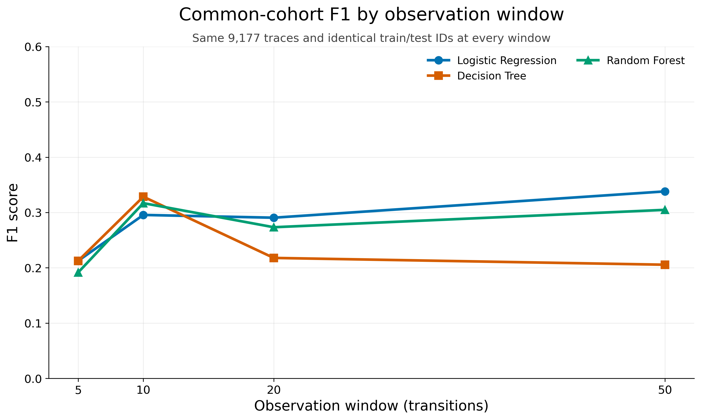

Every plotted point uses the same 9,177 traces and identical split membership.
Logistic Regression improves overall from k=5 to its best F1 of approximately
0.338 at k=50. Decision Tree has its best F1, approximately 0.329, at k=10.
Random Forest also has its best F1, approximately 0.317, at k=10. Improvement
is not monotonic: observing more states does not automatically produce better
hard classifications.

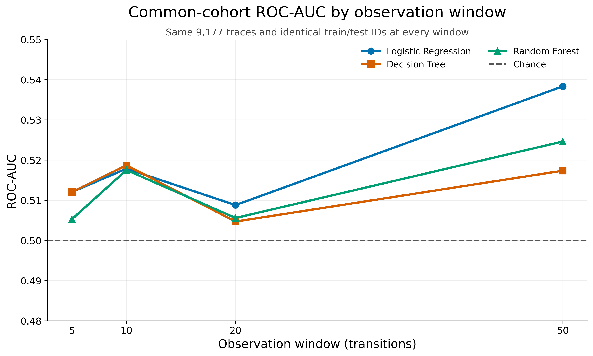

Logistic Regression reaches its highest ROC-AUC, approximately 0.538, at k=50.
Random Forest reaches approximately 0.525 at k=50, while Decision Tree peaks
near 0.519 at k=10. All values remain close to 0.5. The unordered
visited-state representation contains some predictive signal, especially for
longer prefixes, but the signal is weak and inconsistent. This does not imply
that the models are useless.

## 8. Operational versus common-cohort interpretation

The table reports common-cohort minus operational performance.

| k | Model | Delta F1 | Delta ROC-AUC |
| ---: | --- | ---: | ---: |
| 5 | Logistic Regression | -0.0387 | -0.0125 |
| 5 | Decision Tree | -0.0387 | -0.0125 |
| 5 | Random Forest | -0.0598 | -0.0193 |
| 10 | Logistic Regression | -0.0506 | -0.0098 |
| 10 | Decision Tree | -0.0176 | -0.0090 |
| 10 | Random Forest | -0.0293 | -0.0102 |
| 20 | Logistic Regression | -0.0154 | -0.0309 |
| 20 | Decision Tree | 0.0143 | -0.0100 |
| 20 | Random Forest | -0.0512 | -0.0227 |
| 50 | Logistic Regression | 0.0000 | 0.0000 |
| 50 | Decision Tree | 0.0000 | 0.0000 |
| 50 | Random Forest | 0.0000 | 0.0000 |

Common-cohort results are generally lower at k=5, k=10, and k=20. The one F1
exception is Decision Tree at k=20, although its ROC-AUC is still lower. This
shows that part of the earlier performance pattern was related to changing
cohort composition. Results are identical at k=50 because the operational k50
population already consists of traces with more than 50 transitions. The
common cohort is therefore the more defensible design for studying information
gained as `k` increases.

## 9. Candidate-state extraction

Candidates came from the k=20 fixed-window experiment through this provenance
chain:

```text
k20 visited-state dataset
    → saved Logistic Regression and Random Forest
    → candidate-state ranking
    → PRISM valuation mapping
    → exact Storm verification
```

The ranking combines a positive Logistic Regression coefficient, Random
Forest importance, empirical target-probability difference, and support
weighting. The empirical target-probability difference is:

```text
P(target | candidate observed)
− P(target | candidate not observed)
```

The normalized combined score is a ranking heuristic. It is not a probability
and not a formal causality score. Only the selected top 20 candidates were
sent to candidate-specific exact verification. They are not necessarily the
globally best 20 states among all 1,221 Storm states.

## 10. Previous and new exact Storm verification

The previous verification calculated:

```text
P_C(F target)
```

This asks: if the system is currently in candidate state C, what is the exact
probability of eventually reaching the target?

The new verification additionally calculates:

```text
P_initial(F C)
```

This asks: starting from the initial state, what is the exact probability of
eventually reaching candidate C?

Both quantities are needed. Target probability from C measures future risk
after reaching C, while reachability of C measures how much model behavior can
encounter C.

The comparison baseline and exact quantities are:

- Baseline: `P_initial(F target) = 0.3416445845150787`
- Exact candidate reachability: `P_initial(F candidate)`
- Exact target probability from a candidate:
  `P_candidate(F target)`

A useful candidate should ideally be both reasonably reachable and probability
raising. The compact table contains the five highest ML-ranked candidates that
pass exact probability raising, together with every non-probability-raising
candidate. Rows are displayed by exact difference from baseline in descending
order; ML rank is retained to show the original k=20 ranking.

| ML rank | State ID | Valuation summary | Empirical difference | Exact P(reach candidate from initial) | Exact P(target from candidate) | Exact difference from baseline | Raises probability |
| ---: | ---: | --- | ---: | ---: | ---: | ---: | :---: |
| 4 | 69 | `s=3, i=2, nrtr=1, r=4, rrep=2, k=0, l=0` | 0.0942 | 0.032300 | 0.483027 | 0.141382 | Yes |
| 1 | 89 | `s=3, i=3, nrtr=1, r=4, rrep=2, k=0, l=0` | 0.2196 | 0.021920 | 0.476229 | 0.134585 | Yes |
| 2 | 82 | `s=2, i=3, nrtr=1, r=4, rrep=2, k=2, l=0` | 0.2196 | 0.021920 | 0.476229 | 0.134585 | Yes |
| 3 | 101 | `s=2, i=3, nrtr=1, r=4, rrep=2, k=0, l=2` | 0.1956 | 0.019460 | 0.476229 | 0.134585 | Yes |
| 5 | 83 | `s=2, i=2, nrtr=2, r=2, rrep=2, k=0, l=0` | 0.0832 | 0.027455 | 0.391796 | 0.050152 | Yes |
| 16 | 56 | `s=2, i=2, nrtr=1, r=3, rrep=2, k=0, l=0` | 0.0165 | 0.125845 | 0.340099 | -0.001546 | No |
| 20 | 22 | `s=1, i=2, nrtr=0, r=4, rrep=1, k=0, l=0` | -0.0161 | 0.765000 | 0.332988 | -0.008656 | No |
| 15 | 100 | `s=2, i=3, nrtr=1, r=4, rrep=2, k=0, l=1` | -0.0372 | 0.175139 | 0.315332 | -0.026312 | No |

The empirical difference is the previous verification CSV's
`probability_difference` column, equivalent to the sampled
`empirical_probability_difference` requested for this summary. It is joined
to the current exact-reachability rows by `state_id`; the current exact CSV
does not duplicate this empirical association column.

The table shows:

1. State 69 has the largest exact probability increase.
2. States 89, 82, and 101 have the same exact target probability from the
   candidate, although their exact candidate reachabilities are not all the
   same.
3. States 100, 56, and 22 do not raise exact target probability above the
   baseline.
4. High reachability alone does not imply probability raising.
5. The candidates originate from the k=20 ML ranking. Only the selected top 20
   candidates received candidate-specific verification, not all 1,221 states.

The empirical difference and exact probabilities represent different
quantities:

- `empirical_probability_difference` is a sampled association in the k20
  prefix dataset.
- `exact_candidate_reachability` is the unbounded Storm probability of
  reaching the candidate.
- `target_probability_from_candidate` is the exact future target probability
  when currently in the candidate.

The empirical difference is not an exact model-checking probability.

This is state-based verification:

```text
P_candidate(F target)
```

It is not the historical path-conditioned quantity:

```text
P(target | candidate was visited earlier)
```

Across all 20 selected candidates, 17 raise the exact target probability and
the exact candidate-reachability range is `0.0124212116093038` to `0.765`.
State 22 has the greatest exact reachability and highest
`risk_weighted_coverage`, but it does not raise probability above baseline.
High reachability or a high descriptive product does not imply probability
raising.

## 11. Candidate reachability versus future risk

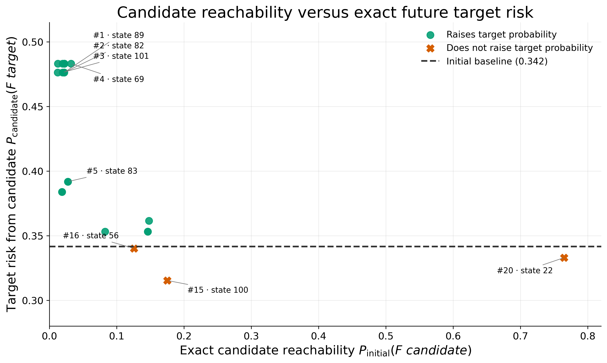

The x-axis is exact initial-to-candidate reachability,
`P_initial(F candidate)`. The y-axis is exact candidate-to-target probability,
`P_candidate(F target)`. The horizontal line is the exact initial target
baseline. Points above it are state-based probability-raising candidates.

The upper-right region contains candidates that are comparatively reachable
and have high future target risk. Upper-left candidates have high future risk
but are rarely reached. Lower-right candidates may be common but do not offer
strong probability raising. This plot helps prioritize candidate states, but
it does not establish causality.

## 12. Exact probability increase by candidate

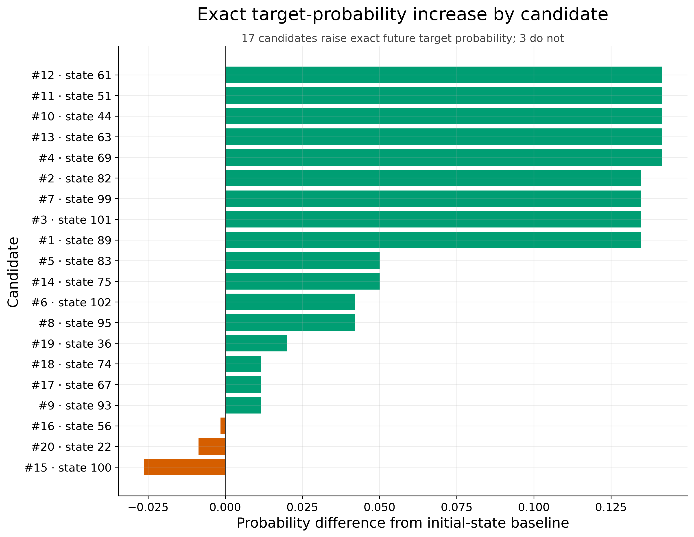

Each bar represents:

```text
P_C(F target) − P_initial(F target)
```

Positive values indicate state-based probability raising; negative values
indicate lower future target probability than the initial baseline. Seventeen
bars are positive and three are non-positive. State 69 has the largest
increase. This is current-state verification, not historical path
conditioning.

## 13. Empirical support versus exact reachability limitation

`empirical_support_fraction` is the fraction of the 9,723 retained k20 rows in
which the candidate occurs within the initial state plus the first 20
transitions. `exact_candidate_reachability` is the unbounded, unconditional
Storm probability `P_initial(F candidate)`.

These are different events:

- empirical support is bounded to the first 20 transitions;
- its population is conditioned on the trace surviving beyond 20 transitions;
- exact Storm reachability is unbounded and unconditional.

The support-reachability gap therefore combines sampling variation, finite
observation horizon, and population conditioning. It must not be interpreted
as pure Monte Carlo estimation error.

## 14. Risk-weighted coverage

The exploratory quantity is:

```text
risk_weighted_coverage
= exact_candidate_reachability × target_probability_from_candidate
```

It is only a descriptive prioritization heuristic. It is not the probability
that failure occurs through the candidate, not a probability of causality, not
a formal probability-raising definition, and not path-conditioned. It does
not account for path overlap or ordering.

## 15. Main findings

1. Controlling the trace population changes the interpretation of the prefix
   experiment.
2. Longer prefixes give modest improvements for some models, but not
   monotonically.
3. ROC-AUC remains near 0.5, so unordered visited-state presence is a weak
   predictor.
4. Logistic Regression performs best at k=50 among the current common-cohort
   models.
5. ML candidate extraction nevertheless identifies many states that pass
   exact state-based probability raising.
6. Exact candidate reachability adds an important coverage dimension.
7. A state can be frequently reached without raising target probability.
8. The current results identify preliminary probability-raising candidate
   states, not proven causes.

## 16. Limitations

- The visited-state representation discards order and repetition.
- Only one BRP model configuration is evaluated.
- Only one main trace sample is currently used.
- Candidate stability across sampling seeds and sample sizes is not yet
  measured.
- Candidate extraction is based on k=20.
- Only the selected top 20 candidates receive candidate-specific reachability
  verification.
- Current Storm verification is state-based.
- Historical path-conditioned probability
  `P(target | candidate was visited earlier)` is not yet calculated.
- The risk-weighted product is only heuristic.
- Runtime measurements depend on the machine and environment.

## 17. Recommended next experiments

1. Run a sample-size study with 500, 1,000, 2,500, 5,000, and the full cohort.
2. Repeat the experiments with several sampling seeds.
3. Measure top-k candidate-ranking stability.
4. Compare full-trace empirical visitation with exact unbounded candidate
   reachability.
5. Interpret the top candidate valuations at the PRISM semantic level.
6. Optionally test transition-count or sequence-aware features after the
   systematic baseline is complete.

Neural networks are not the immediate required next step.

## 18. Presentation summary

### Two-minute presentation explanation

Since the previous meeting, I focused on making the BRP prefix experiment a
controlled comparison and connecting the ML candidates to exact model
checking. The original operational datasets retained traces separately at
each observation window, so longer windows progressively removed short
target-ending traces. That meant both the available information and the trace
population changed at the same time.

I therefore created a common cohort of 9,177 traces that all survive beyond 50
transitions. The same traces and train/test membership are used for k=5, 10,
20, and 50. Logistic Regression gives the strongest common-cohort result at
k=50, with F1 approximately 0.338 and ROC-AUC approximately 0.538. Decision
Tree and Random Forest peak at different windows, and improvement is not
monotonic. ROC-AUC remains close to 0.5, so unordered visited-state presence
contains some signal but provides weak and inconsistent discrimination.

For the k=20 ML-selected candidates, I extended exact verification beyond the
probability of reaching the target from each state. The analysis now also
computes the exact probability of reaching each candidate from the initial
state. Seventeen of 20 candidates raise future target probability above the
initial baseline. However, state 22 illustrates the central caution: it is the
most reachable candidate and has the highest descriptive risk-weighted
coverage, yet it does not raise target probability. These results identify
preliminary state-based probability-raising candidates, not proven causes.
The main limitation is that visited-state features discard order, and the
verification does not yet compute historical path-conditioned probability.

## 19. Selected plots

The five embedded plots above were selected because together they explain the
cohort correction, F1 behavior, score-ranking quality, candidate reachability,
and exact probability raising:

1. `operational_retained_traces_by_window.png`
2. `common_cohort_f1_by_window.png`
3. `common_cohort_roc_auc_by_window.png`
4. `exact_candidate_reachability_vs_target_risk.png`
5. `exact_probability_increase_by_candidate.png`

### Additional generated plots

- [Operational versus common-cohort F1](../../results/systematic/brp_stress_error/plots/operational_vs_common_f1.png)
- [Operational versus common-cohort ROC-AUC](../../results/systematic/brp_stress_error/plots/operational_vs_common_roc_auc.png)
- [Operational target rate by window](../../results/systematic/brp_stress_error/plots/operational_target_rate_by_window.png)
- [Empirical support versus exact reachability](../../results/systematic/brp_stress_error/plots/empirical_support_vs_exact_reachability.png)
- [Exact candidate reachability by candidate](../../results/systematic/brp_stress_error/plots/exact_candidate_reachability_by_candidate.png)
- [Risk-weighted coverage by candidate](../../results/systematic/brp_stress_error/plots/risk_weighted_coverage_by_candidate.png)

## 20. Reproduction commands

Run these commands from the repository root.

Generate the common-cohort datasets and manifest:

```bash
python -m scripts.generate_brp_common_cohort_datasets
```

Run the common-cohort baselines and operational comparison:

```bash
python -m scripts.run_brp_common_cohort_baselines
```

Run exact initial-to-candidate and candidate-to-target verification:

```bash
python -m scripts.verify_brp_candidate_states \
    --model models/prism/brp/brp_stress_error_target.pm \
    --property models/properties/brp/brp_target.pctl \
    --candidates results/candidate_states/brp_k20_candidate_states.csv \
    --output results/systematic/brp_stress_error/reachability/candidate_exact_reachability.csv \
    --top-k 20
```

Generate all current experiment plots and the plot summary:

```bash
python scripts/plot_brp_current_experiments.py
```

## 21. Artifact links

Common-cohort artifacts:

- [Common-cohort manifest](../../results/systematic/brp_stress_error/metrics/common_cohort_manifest.json)
- [Common-cohort per-model metrics](../../results/systematic/brp_stress_error/metrics/common_cohort_per_model.csv)
- [Common-cohort summary](../../results/systematic/brp_stress_error/metrics/common_cohort_summary.json)
- [Operational-versus-common comparison](../../results/systematic/brp_stress_error/metrics/operational_vs_common_cohort.csv)

Candidate-verification artifacts:

- [Exact candidate-reachability results](../../results/systematic/brp_stress_error/reachability/candidate_exact_reachability.csv)
- [Exact candidate-reachability metadata](../../results/systematic/brp_stress_error/reachability/candidate_exact_reachability.metadata.json)

Plots and descriptions:

- [Current plot summary](../../results/systematic/brp_stress_error/reports/current_plot_summary.md)
- [Plotting script](../../scripts/plot_brp_current_experiments.py)

Relevant experiment runners:

- [Common-cohort dataset generator](../../scripts/generate_brp_common_cohort_datasets.py)
- [Common-cohort baseline runner](../../scripts/run_brp_common_cohort_baselines.py)
- [Exact candidate verifier](../../scripts/verify_brp_candidate_states.py)

# Meeting Update — Training Sample Size and Candidate Stability

**Date: 2026-08-03**

## 1. Research question

The follow-up experiment asks:

> At what training-sample size do prediction quality, candidate-state identity,
> and exact Storm-verified candidate quality become unstable, and does this
> differ across Logistic Regression, Decision Tree, and Random Forest?

Reducing the training set is not automatically the same as underfitting.
Underfitting means that a model cannot represent or learn the available signal
adequately. Reducing data instead increases estimation uncertainty: different
subsets may support different fitted parameters, predictions, and candidate
rankings, and rare learnable patterns may not appear often enough to be learned
stably.

## 2. Experimental design

The experiment uses the k=20 fixed observation window and the common-cohort
visited-state dataset. The design is:

- total common-cohort rows: 9,177;
- fixed training pool: 7,341 rows;
- fixed test set: 1,836 rows;
- training sizes: 500, 1,000, 2,500, 5,000, and 7,341;
- reduced-sample seeds: 42, 123, 456, 789, and 2026;
- models: Logistic Regression, Decision Tree, and Random Forest;
- candidate list length: 20 states;
- candidate statistics: sampled training rows only;
- exact Storm verification: applied after candidate selection.

Every reduced sample is drawn by stratified sampling from the same 7,341-row
training pool. For a given size and seed, all three models receive identical
training trace IDs. The 7,341-row condition is one deterministic fit on the
complete pool, not five duplicate samples.

The test set remains fixed for every condition. If the test set also changed,
differences in a metric could come from either the training subset or the test
composition. Reusing the same 1,836 traces isolates training-sample effects and
makes model results directly comparable. Test labels never enter candidate
construction or ranking.

## 3. Understanding mean and standard deviation

For each reduced sample size, the experiment is repeated with five random
stratified subsets. If the five measurements are
`x₁, x₂, ..., x₅`, their mean is:

```text
x̄ = (x₁ + x₂ + ... + x₅) / 5
```

The reported sample standard deviation is:

```text
s = sqrt[ Σᵢ(xᵢ - x̄)² / (n - 1) ], where n = 5
```

The mean is the average result across the five sampled training sets. Standard
deviation measures sensitivity to which traces were selected. A large standard
deviation means that the conclusion is unstable across samples; a small one
means that different samples give similar results. The full 7,341-row condition
has no sampling standard deviation because it is one deterministic reference
using the complete training pool.

## 4. Prediction results

Full five-seed F1 results are:

| Training rows | Logistic Regression | Decision Tree | Random Forest |
|---:|---:|---:|---:|
| 500 | 0.336 ± 0.062 | 0.343 ± 0.061 | 0.330 ± 0.062 |
| 1,000 | 0.288 ± 0.062 | 0.260 ± 0.115 | 0.313 ± 0.055 |
| 2,500 | 0.283 ± 0.022 | 0.284 ± 0.078 | 0.271 ± 0.025 |
| 5,000 | 0.264 ± 0.028 | 0.251 ± 0.032 | 0.274 ± 0.022 |
| 7,341 | 0.291 | 0.218 | 0.273 |

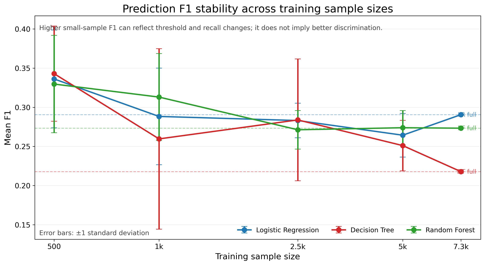

The higher F1 values at 500 rows do not show superior discrimination. The
class-balanced models can change their decision thresholds and predict more
positives, raising recall and therefore F1. Meanwhile, mean ROC-AUC stays
between approximately 0.492 and 0.509 across the table, which is close to
random ranking at 0.5. Decision Tree is especially sample-sensitive at 1,000
rows, where its F1 standard deviation is 0.115.

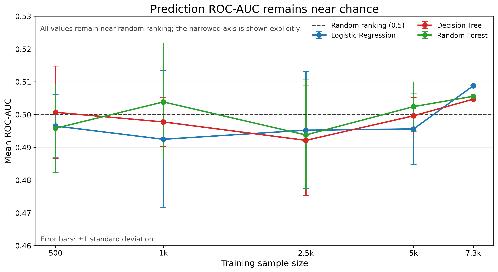

## 5. Candidate ranking stability

Top-k overlap compares a sampled ranking with the deterministic full-training
ranking:

```text
top-k overlap = |sample top-k ∩ full top-k| / k
```

Jaccard similarity divides the same intersection by the size of the union,
`|A ∩ B| / |A ∪ B|`, so it penalizes candidates appearing in only one list.
Spearman correlation measures agreement in rank order among the states shared
by the two top-20 lists. Correlation can be unstable even when set overlap is
moderate because shared states may move substantially within the ranking.

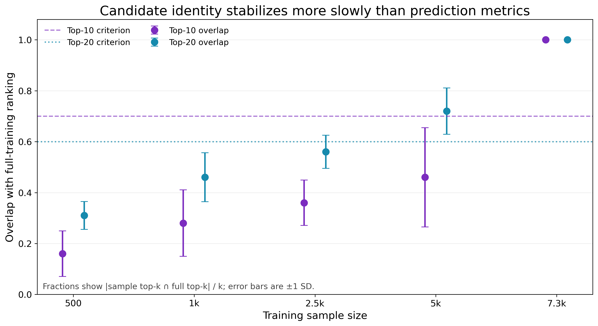

At 5,000 rows, mean top-20 overlap reaches 0.72, but mean top-10 overlap is only
0.46. The top of the candidate list is therefore less stable than the relative
prediction metrics.

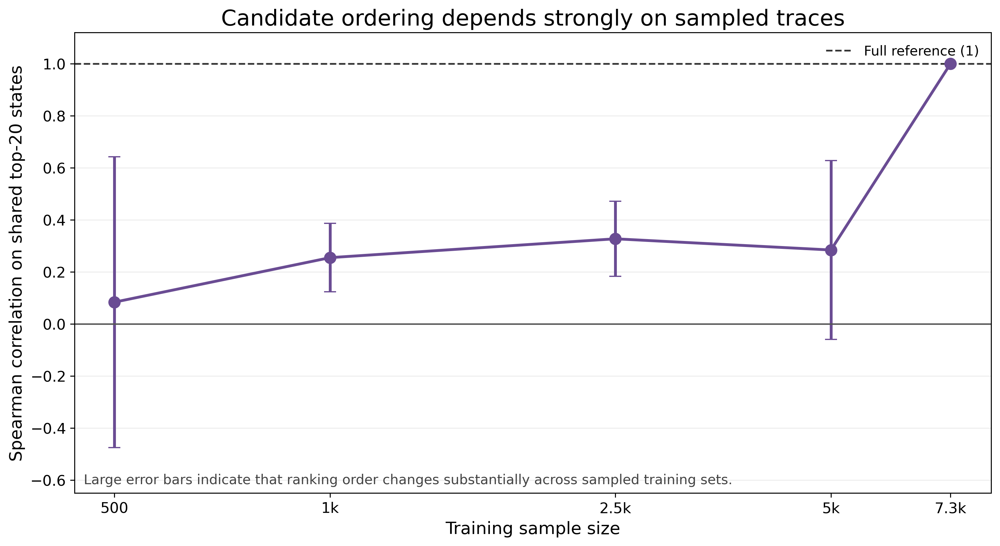

The five-seed mean Spearman correlation at 5,000 rows is only 0.284 with SD
0.343. This indicates that candidate order remains strongly dependent on which
training traces were sampled.

## 6. Exact candidate quality

For every ranking run, each of its top 20 states is checked using exact Storm
model checking. A state passes when:

```text
P_candidate(F target) > P_initial(F target)
```

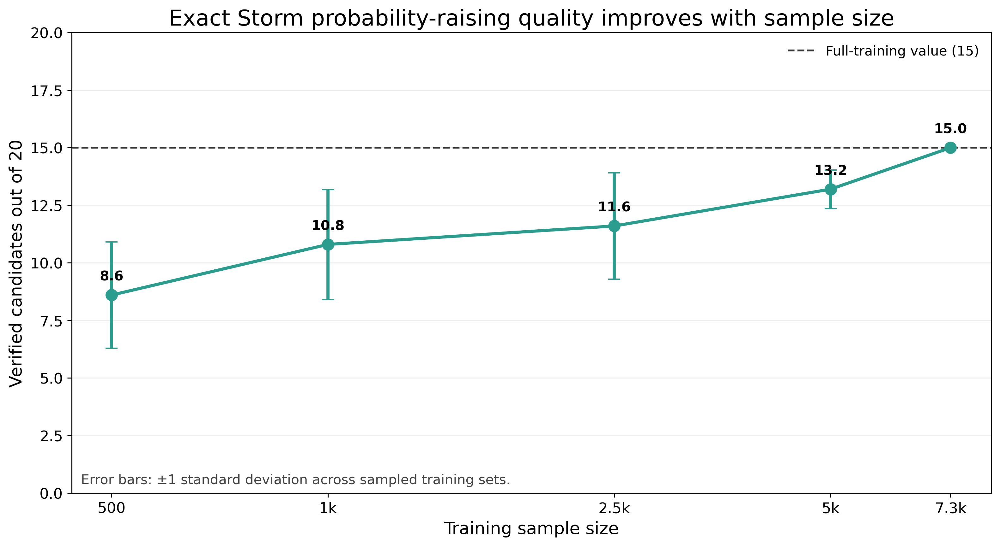

| Training rows | Verified candidates out of 20 |
|---:|---:|
| 500 | 8.60 ± 2.30 |
| 1,000 | 10.80 ± 2.39 |
| 2,500 | 11.60 ± 2.30 |
| 5,000 | 13.20 ± 0.84 |
| 7,341 | 15.00 |

Only the full training reference reaches the selected threshold of 15 verified
candidates out of 20. This check is state-based probability raising: it asks
about future target reachability when starting from the candidate state. It is
not historical path-conditioned causality and does not estimate the effect of
having visited that state earlier along an execution.

## 7. Ranking-method comparison

The experiment compares six ways of choosing candidate states:

- **Combined:** normalized positive LR coefficient, RF importance, positive
  empirical probability difference, and support weighting.
- **Empirical only:** empirical target-probability difference.
- **LR only:** positive Logistic Regression coefficient.
- **RF only:** Random Forest feature importance.
- **Frequency only:** visited-state support.
- **Random:** deterministic random sets drawn from eligible observed states.

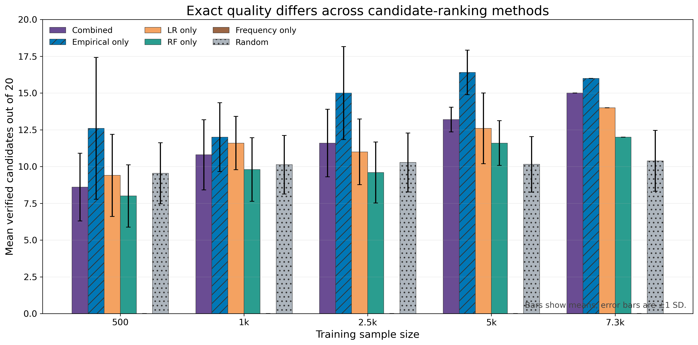

Empirical-only ranking produces the largest mean exact pass count at every
tested size in this experiment. This does not establish that it is universally
optimal: the result is specific to this model, feature representation, horizon,
and quality measure. The combined method averages 8.60 passes at 500 rows,
slightly below the random mean of 9.55, but exceeds the random mean from 1,000
rows onward. Frequency-only produces zero exact probability-raising states at
every size. The combined score's added value is therefore not established by
this experiment.

## 8. Reliability criteria

The reliability thresholds are analyst-selected operational criteria, not
universal statistical laws. Prediction checks require F1 and ROC-AUC to remain
close to their full-training references and F1 SD to be below 0.05. Candidate
checks require top-10 overlap of at least 0.70, top-20 overlap of at least 0.60,
at least 15 exact passes, and exact-pass-count SD below 2.0.

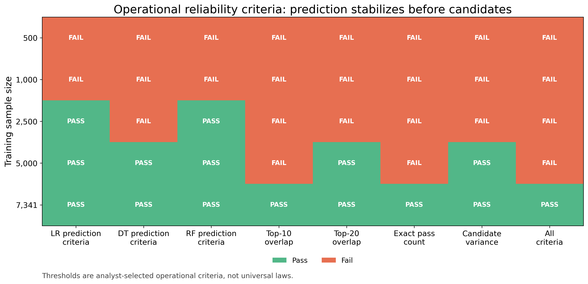

The prediction-relative criteria pass earlier: Logistic Regression and Random
Forest first pass them at 2,500 rows, while Decision Tree first passes at 5,000.
Candidate criteria require more data. At 5,000 rows top-20 overlap and candidate
variance pass, but top-10 overlap and exact pass count fail. Only the full
7,341-row condition passes every selected criterion.

## 9. 17/20 versus 15/20

The earlier result of 17 verified candidates out of 20 came from the complete
9,723-row operational k20 candidate dataset, whose population satisfied
`number_of_transitions > 20`. The current result of 15/20 comes from the
stricter common-cohort training pool of 7,341 rows, whose parent cohort satisfies
`number_of_transitions > 50`; the fixed 1,836-row test set is excluded from
candidate discovery.

The two top-20 lists share 13 states. Their exact initial baseline is identical,
and all exact probabilities and pass flags for shared states agree exactly.
The 17/20 versus 15/20 difference is therefore caused by population-dependent
candidate substitutions, not inconsistent Storm verification.

## 10. Main findings

1. Prediction metrics can appear stable before candidate rankings stabilize.
2. Similar F1 does not imply that the same candidate states are selected.
3. ROC-AUC remains near random ranking at every sample size.
4. Decision Tree is the most variable model in the small-data conditions.
5. Exact candidate quality improves overall with sample size.
6. Five thousand training rows are still insufficient for stable top-10
   candidate identity.
7. Empirical-difference-only ranking outperforms the combined heuristic on exact
   pass count in this experiment.
8. Exact Storm verification remains necessary because empirical and fitted-model
   evidence do not guarantee exact probability raising.

## 11. Limitations

- Only five reduced-sample seeds are evaluated.
- Only one BRP model setting is used.
- Candidate stability is evaluated only at k=20.
- The full-training condition is one deterministic reference and has no
  sampling-variance estimate.
- Binary state-presence features ignore order and repeated visits.
- Reliability thresholds are analyst-selected.
- Exact verification is state-based, not intervention-based.
- The analysis does not establish historical path-conditioned causality.
- Random baselines are restricted to eligible observed states.

## 12. Two-minute meeting explanation

The question in this follow-up was how much training data we need before the
BRP results become stable—not only the prediction score, but also which states
the machine-learning pipeline proposes and whether Storm verifies those states.
I used the k=20 common cohort, with 9,177 traces, and reconstructed the existing
fixed split: 7,341 traces in the training pool and the same 1,836 test traces
for every condition. I then sampled 500, 1,000, 2,500, and 5,000 training traces
with five stratified seeds, plus one full-training reference. Keeping the test
set fixed means changes come from training-data selection rather than a changing
evaluation population.

The prediction result needs caution. F1 is sometimes higher with only 500
traces because the balanced models change how often they predict the positive
class, which raises recall. But ROC-AUC stays around 0.5 at every size, so this
does not represent stronger discrimination. Decision Tree is particularly
unstable at 1,000 rows, with F1 standard deviation about 0.115.

Candidate rankings need more data than the prediction-relative metrics. At
5,000 rows, the mean top-20 overlap with the full ranking is 72 percent, but
top-10 overlap is only 46 percent, and shared candidates still move considerably
in rank. Exact Storm verification shows a clearer progression: the average
number of probability-raising states rises from 8.6 out of 20 at 500 rows to
13.2 at 5,000, while the full reference reaches 15.

The empirical-difference-only ranking produces the most verified candidates at
every tested size. The combined heuristic is slightly worse than random at 500
rows and better than random from 1,000 onward, so its added value is not yet
established. The main limitation is that this is one BRP setting at k=20 with
state-presence features. Exact verification is state-based and does not prove
historical causality.

## 13. Reproduction and artifact links

The recorded full experiment runner took 16.43 seconds using the existing
processed dataset. This timing excludes trace generation and presentation-plot
rendering.

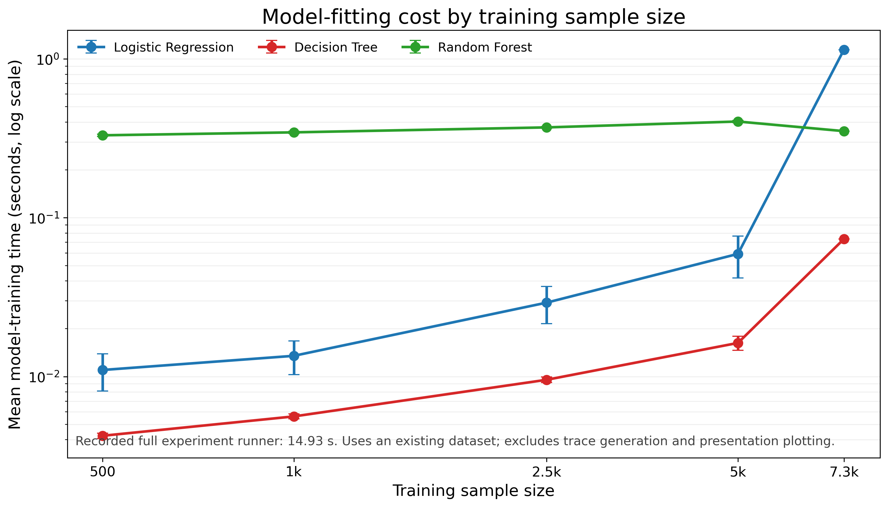

- [Full five-seed report](../../results/systematic/brp_stress_error/sample_size_full/full_run_report.md)
- [Aggregated prediction metrics](../../results/systematic/brp_stress_error/sample_size_full/prediction_aggregated.csv)
- [Aggregated candidate stability](../../results/systematic/brp_stress_error/sample_size_full/candidate_stability_aggregated.csv)
- [Aggregated exact candidate quality](../../results/systematic/brp_stress_error/sample_size_full/exact_candidate_quality_aggregated.csv)
- [Ranking-method comparison](../../results/systematic/brp_stress_error/sample_size_full/ranking_method_comparison.csv)
- [Reliability assessment](../../results/systematic/brp_stress_error/sample_size_full/reliability_assessment.csv)
- [Presentation plot directory](../../results/systematic/brp_stress_error/sample_size_full/presentation_plots/)
- [Experiment configuration](../../experiments/brp_k20_sample_size_stability.json)
- [Experiment runner](../../scripts/run_brp_sample_size_experiment.py)
- [Plotting script](../../scripts/plot_brp_sample_size_experiment.py)
